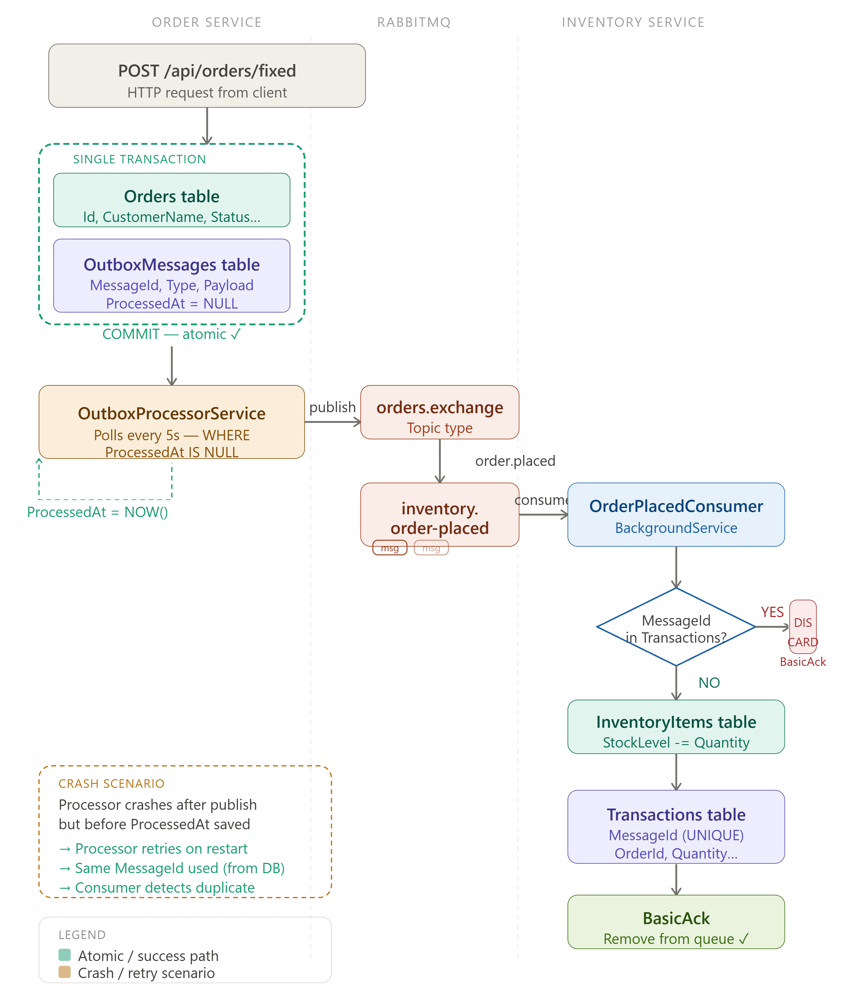

# Microservices Outbox Pattern

A .NET 8 sample demonstrating reliable event delivery between an Order Service and an Inventory Service using the transactional outbox pattern.

## Architecture



The Order Service saves the business operation and its integration event in the same database transaction. A background publisher forwards the event to the message broker, and the Inventory Service consumes it to update inventory. This prevents events from being lost when a database write succeeds but message publication fails.

## Services

- **OrderService** — accepts orders, persists order data, and publishes `OrderPlacedEvent` messages through the outbox.
- **InventoryService** — consumes order events and updates inventory data.

## Run locally

1. Configure the database and message broker connections in each service's `appsettings.json`.
2. Restore and build both services:

   ```powershell
   dotnet restore .\OrderService\OrderService.sln
   dotnet restore .\InventoryService\InventoryService.sln
   dotnet build .\OrderService\OrderService.sln
   dotnet build .\InventoryService\InventoryService.sln
   ```

3. Start each service in a separate terminal:

   ```powershell
   dotnet run --project .\OrderService\OrderService.csproj
   dotnet run --project .\InventoryService\InventoryService.csproj
   ```

